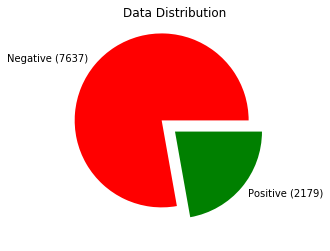
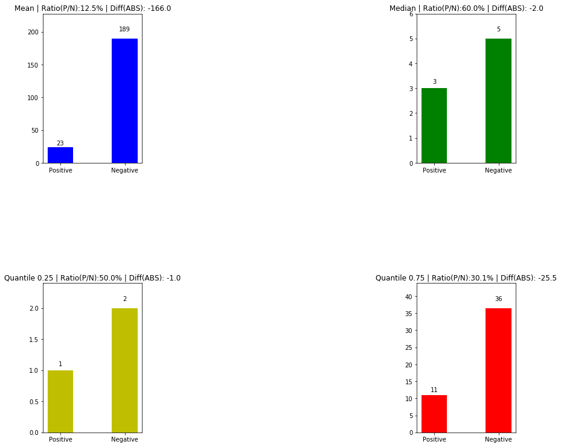
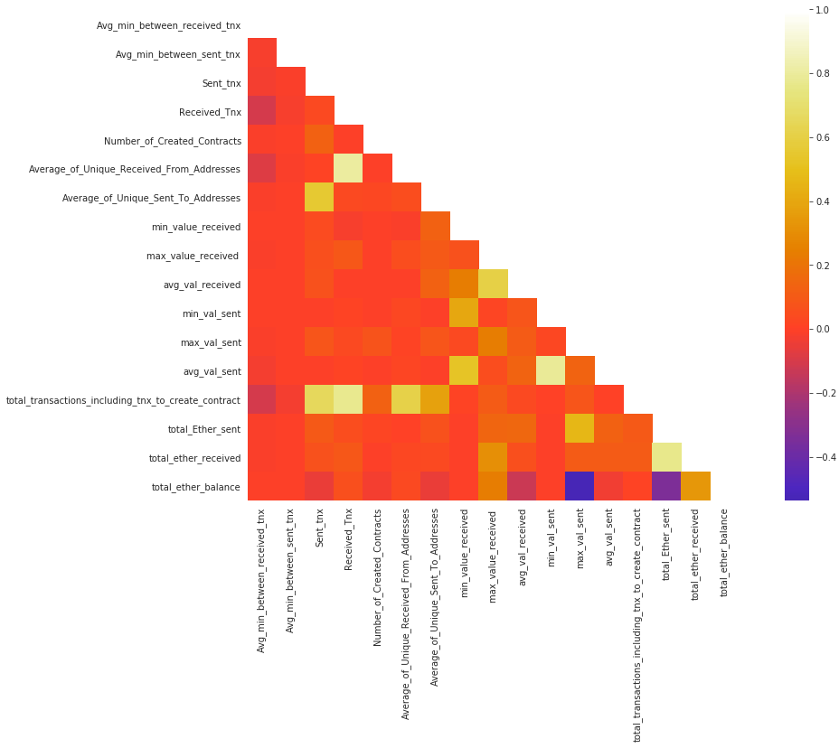
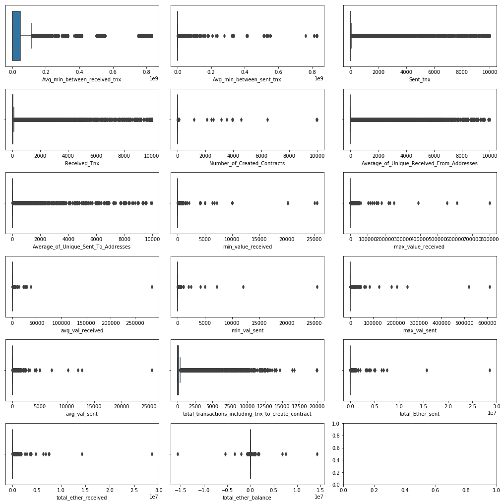

# Ethereum Fraud Detection Visualization

--------------

### [Sepand Haghighi](https://github.com/sepandhaghighi) - [Farzad Ramezani](https://github.com/Farziiii)

### September 2022

--------------

## Overview

Fraud detection is a process that detects and prevents fraudsters from obtaining money or property through false means. It is a set of activities undertaken to detect and block the attempt of fraudsters from obtaining money or property fraudulently. Fraud is an expensive and complicated problem. To detect and investigate it effectively, you need to see connections – between people, accounts, transactions, and dates – and understand complex sequences of events. That means analyzing a lot of data.
Fraud detection is prevalent across banking, insurance, medical, government, and public sectors, as well as in law enforcement agencies.

**Advantages of Visualizations in Fraud Detection:**

The detection of fraud schemes requires an investigation of a vast amount of data that stems from many different anti-fraud systems with varying types of data. The auditors have to combine all the data and use statistical methods to uncover suspicious claims, which is time-consuming and inefficient in most cases.

Visualizations, on the other hand, can enhance the quick identification of relationships and significant structures and the detection of suspicious patterns that may hide in the amount of data. Besides the visual exploration, interaction with the data allows for a deeper understanding of the dependencies within the data changing over time.

One of the most challenging tasks when using visualization for fraud detection is the sheer amount of data that is usually obtained by auditing systems. First, the auditor has to retrieve the data from the auditing system. Visualizing such a large amount of data is the next challenge: the data needs a meaningful arrangement to create a human-readable representation. Providing suitable styling should enable users to identify different types of entities and relations.

Since there exist a lot of different types of fraud schemes, it is clear that there is no unique solution that can detect all of them. Thus, a visualization meant to fight against fraud has to be adaptive to the needs of each auditor.

At first, it must not limit to a specific amount or type of data since the volume of the investigated data grows exponentially and comes from different sources. In some cases, it is also necessary to be able to support and visualize time-dependent data.

A sophisticated visualization should also provide the means for arranging the elements in multiple ways on the screen, i.e., using arrangements that reveal clusters or others that highlight hierarchical structures. Additionally, more sophisticated graph analysis algorithms should be supported for the detection of fraud schemes, e.g., cycle detection, or shortest paths.

Regarding the representation of the elements of the visualization, an auditor should be able to customize the look and feel of the graph elements based on his/her needs and be able to display additional properties of the graph elements. Finally, interaction is one of the essential operations when visualizing fraud data since it allows the auditor to explore its dataset.

Fraud detection can be separated by the use of statistical data analysis techniques or artificial intelligence. 

**Statistical data analysis techniques include:**

1. calculating statistical parameters
2. regression analysis
3. probability distributions and models
4. data matching

**AI techniques used to detect fraud include:**

1. Data mining classifies, groups and segments data to search through millions of transactions to find patterns and detect fraud.
2. Neural networks learn suspicious-looking patterns and use those patterns to detect them further.
3. Machine learning automatically identifies characteristics found in fraud.
4. Pattern recognition detects classes, clusters and patterns of suspicious behavior.

Cryptocurrency fraud analysts look at huge volumes of historical data spanning long time periods. Our main idea is to comprehensively examine and visualize the available data related to fraud detection in the Ethereum network.

**Our suggested steps to visualize data:**

1. Downloading and collecting data
2. Data cleaning
3. Data statistics and distribution
4. Comparing different features of data between fraud and non-fraud classes

## Datasets

We will use two data set in this report.

1. [Ethereum Fraud Detection Dataset](https://www.kaggle.com/datasets/vagifa/ethereum-frauddetection-dataset)
2. [Ethereum Fraud Dataset](https://www.kaggle.com/datasets/gescobero/ethereum-fraud-dataset)

We will analyze these two datasets both individually and in combination.

	<table style="text-align:center;border-collapse:collapse;">
		<th>
			<td>Number of Features</td>
			<td>Total Cases</td>
			<td>Fraud Cases</td>
			<td>Non-Fraud Cases</td>
		</th>
		<tr>
			<td style="text-align:left;">Ethereum Fraud Detection Dataset</td>
			<td>37</td>
			<td>9816</td>
			<td>2179</td>
			<td>7637</td>
		</tr>
		<tr>
			<td style="text-align:left;">Ethereum Fraud Dataset</td>
			<td>31</td>
			<td>12146</td>
			<td>5150</td>
			<td>6996</td>
		</tr>
		<tr>
			<td style="text-align:left;">Merged Dataset</td>
			<td>17</td>
			<td>20302</td>
			<td>5675</td>
			<td>14627</td>
		</tr>
	</table>
	
Table1. Datasets Overview

## Requirements

1. Python >= 3.5
2. pandas >= 0.24.2
3. matplotlib >= 3.0.3
4. seaborn >= 0.9.1
5. numpy >= 1.18.5
6. notebook >= 5.7.4

- Run `pip install -r requirements.txt` or `pip3 install -r requirements.txt`

## Notebooks

	<table style="text-align:center;border-collapse:collapse;">
		<th>
			<td>GitHub Viewer</td>
			<td>NB Viewer</td>
			<td>Google Colab</td>
		</th>
		<tr>
			<td style="text-align:left;">Ethereum Fraud Detection Dataset</td>
			<td><a href="https://github.com/sepandhaghighi/Ethereum-Fraud-Detection-Visualization/blob/master/1.ipynb">Link</a></td>
			<td><a href="https://nbviewer.org/github/sepandhaghighi/Ethereum-Fraud-Detection-Visualization/blob/master/1.ipynb">Link</a></td>
			<td></td>
		</tr>
		<tr>
			<td style="text-align:left;">Ethereum Fraud Dataset</td>
			<td><a href="https://github.com/sepandhaghighi/Ethereum-Fraud-Detection-Visualization/blob/master/2.ipynb">Link</a></td>
			<td><a href="https://nbviewer.org/github/sepandhaghighi/Ethereum-Fraud-Detection-Visualization/blob/master/2.ipynb">Link</a></td>
			<td></td>
		</tr>
		<tr>
			<td style="text-align:left;">Merged Dataset</td>
			<td><a href="https://github.com/sepandhaghighi/Ethereum-Fraud-Detection-Visualization/blob/master/3.ipynb">Link</a></td>
			<td><a href="https://nbviewer.org/github/sepandhaghighi/Ethereum-Fraud-Detection-Visualization/blob/master/3.ipynb">Link</a></td>
			<td></td>
		</tr>
	</table>
	
Table2. Notebooks

## Visualization Example

Here you can see a limited number of examples. The full version of this visualization and all codes can be seen in the notebooks!

Fig1. Data Distribution Pie Diagram

Fig2. Most Received Token Type Pie Diagram (Fraud Cases)

Fig3. Received Transactions Different Statistics Comparing

Fig4. Features Correlation Diagram

Fig5. Features Distribution Diagram

